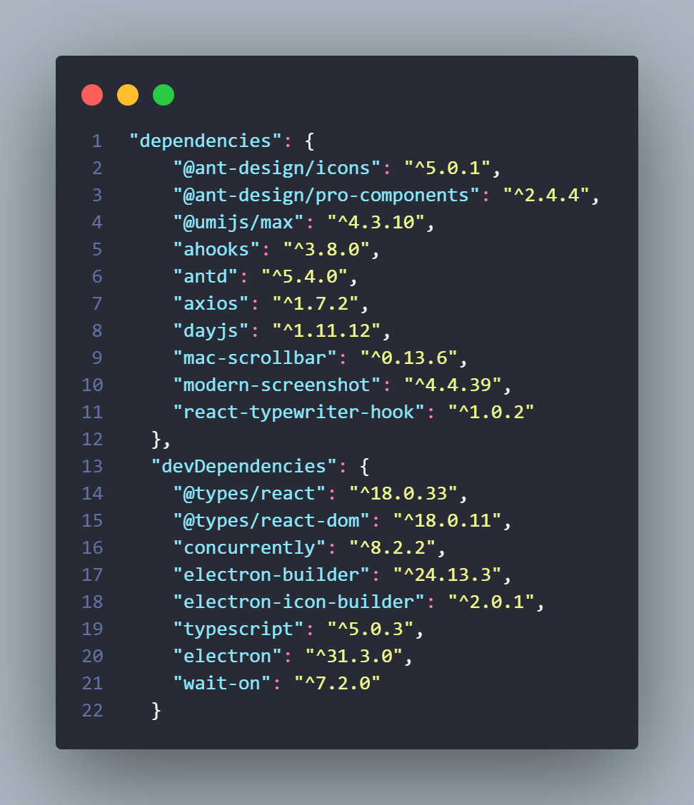

<!-- PROJECT LOGO -->

<p align="center">
  <a href="https://github.com/Allensht/SHTDaily-PC/">
    
  </a>

  <h3 align="center">SHTDaily | 你的个人助手</h3>
  <p align="center">
    <br />
    <a href="https://github.com/Allensht/SHTDaily-PC/issues">报告Bug</a>
    ·
    <a href="https://github.com/Allensht/SHTDaily-PC/issues">提出新特性</a>
    ·
    <a href="https://github.com/Allensht/SHTDaily-PC/pulls">参与贡献</a>
  </p>

</p>
 
## 目录

- [使用指南](#使用指南)
- [文件目录说明](#文件目录说明)
- [使用到的框架](#使用到的框架)
- [贡献者](#贡献者)
  - [如何参与开源项目](#如何参与开源项目)
- [版本控制](#版本控制)
- [作者](#作者)
- [赞助](#赞助)
- [讨论](#讨论)
- [版权说明](#版权说明)
- [赞助](#赞助)

### 使用指南

1. 克隆本项目
2. 安装项目依赖
3. 开发: 运行项目 or 使用: 打包项目


### 文件目录说明

```
SHTDaily-PC
├─ .npmrc // 指定了淘宝镜像源，可忽略
├─ package.json
├─ tsconfig.json
├─ typings.d.ts
├─ src // 项目主要部分
│  ├─ pages
│  │  ├─ settings
│  │  │  ├─ index.less
│  │  │  ├─ index.tsx
│  │  │  └─ mod
│  │  │     ├─ themeTool
│  │  │     │  ├─ index.less
│  │  │     │  └─ index.tsx
│  │  │     └─ languageTool
│  │  │        └─ index.tsx
│  │  ├─ news
│  │  │  └─ index.tsx
│  │  ├─ hot
│  │  │  ├─ toutiao.tsx
│  │  │  ├─ weibo.tsx
│  │  │  └─ zhihu.tsx
│  │  ├─ home
│  │  │  ├─ index.less
│  │  │  └─ index.tsx
│  │  └─ custom
│  │     ├─ shareTool
│  │     │  └─ index.tsx
│  │     ├─ reload
│  │     │  ├─ index.less
│  │     │  └─ index.tsx
│  │     └─ newsList
│  │        └─ index.tsx
│  ├─ locales // 多语言
│  │  ├─ en-US.json
│  │  └─ zh-CN.json
│  ├─ layouts // 布局目录
│  │  ├─ index.less
│  │  ├─ index.tsx
│  │  ├─ pageConfig.tsx
│  │  └─ custom
│  │     └─ burger
│  │        ├─ index.less
│  │        └─ index.tsx
│  └─ assets // 资源目录
│     ├─ avatar.tsx
│     ├─ homePage.gif
│     ├─ logo.png
│     └─ toutiao.svg
├─ main // electron入口目录
│  ├─ index.js
│  └─ preload.js
└─ icons // 项目图标，打包会用到
   ├─ win
   │  └─ icon.ico
   ├─ png
   │  ├─ 1024x1024.png
   │  ├─ 128x128.png
   │  ├─ 16x16.png
   │  ├─ 24x24.png
   │  ├─ 256x256.png
   │  ├─ 32x32.png
   │  ├─ 48x48.png
   │  ├─ 512x512.png
   │  └─ 64x64.png
   └─ mac
      └─ icon.icns

```


### 使用到的框架



### 贡献者

暂无，期待你的加入！

#### 如何参与开源项目

贡献使开源社区成为一个学习、激励和创造的绝佳场所。你所作的任何贡献都是**非常感谢**的。

1. Fork本项目
2. 创建你的功能分支 (`git checkout -b feature/AmazingFeature`)
3. 提交你的更改 (`git commit -m 'Add some AmazingFeature'`)
4. 推送到你的功能分支 (`git push origin feature/AmazingFeature`)
5. 提交你的拉取请求

### 版本控制

该项目使用Git进行版本管理。您可以在repository参看当前可用版本。

### 作者

allensht@outlook.com

 *您也可以在贡献者名单中参看所有参与该项目的开发者。*

### 讨论

QQ群: XXXXXX

### 版权说明

该项目签署了**GNU GPLv3**授权许可，详情请参阅 [LICENSE.txt](https://github.com/Allensht/blob/master/LICENSE.txt)

### 赞助

参与本项目的赞助或向您周围的人介绍本项目就是对作者最大的赞助！
